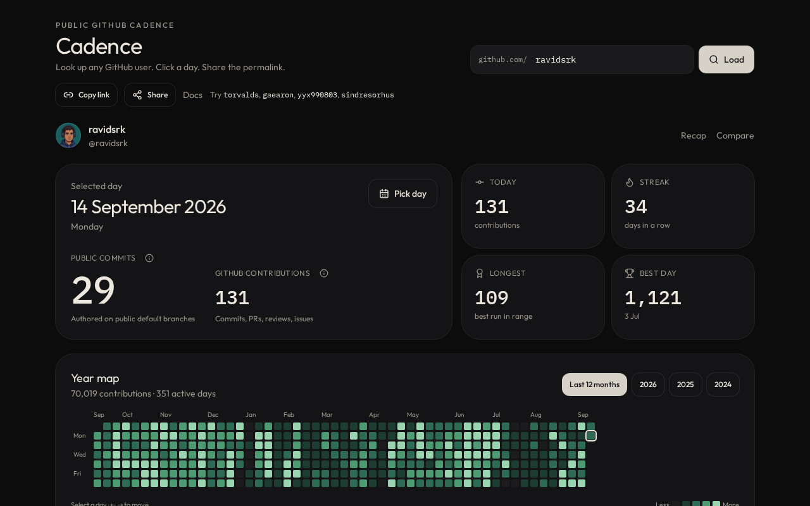

# Cadence

Public GitHub shipping calendar. Look up any user, click a day, share a permalink.

**Live:** [git-cadence.grok.me](https://git-cadence.grok.me) · [ravidsrk](https://git-cadence.grok.me/u/ravidsrk) · [2026 recap](https://git-cadence.grok.me/u/ravidsrk/2026) · [Biggest day](https://git-cadence.grok.me/board) · [Docs](https://git-cadence.grok.me/docs)

README badge:

```md
[](https://git-cadence.grok.me/u/ravidsrk)
```



Cadence reads the public contribution graph and public commit search. Click a square to see the commits authored that day, plus weekday rhythm, streak, and consistency.

Private work can still fill heatmap squares without appearing in the commit log.

## Product docs

- [Using Cadence](./docs/guide.md)
- [Metrics](./docs/metrics.md)
- [Data and privacy](./docs/data.md)
- [FAQ](./docs/faq.md)

The same docs are at [git-cadence.grok.me/docs](https://git-cadence.grok.me/docs).

## Run locally

Needs Node 22.

```bash
git clone https://github.com/ravidsrk/cadence.git
cd cadence
npm install
npm run dev
```

Optional: set `GITHUB_TOKEN` (or `GH_TOKEN`) to raise GitHub API rate limits. Copy `.env.example` if you want a local file — this project reads the variable from the environment.

```bash
npm run typecheck
npm test
npm run build
```

## Stack

TanStack Start, React 19, Tailwind v4, TanStack Query, Recharts.

## License

MIT. See [LICENSE](./LICENSE).
